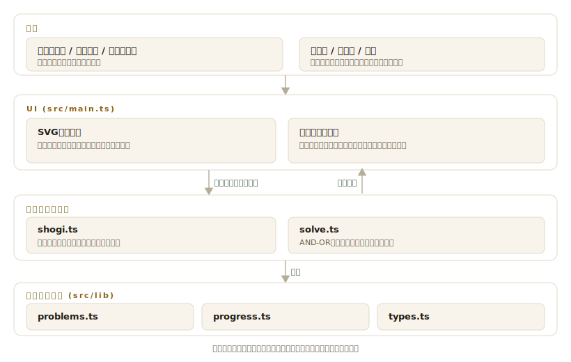

# tsumeshogi

[](https://github.com/miruky/tsumeshogi/actions/workflows/ci.yml)
[](https://github.com/miruky/tsumeshogi/actions/workflows/deploy.yml)
[](https://www.typescriptlang.org/)
[](LICENSE)

**ブラウザで解く詰将棋トレーナー。SVGの盤面で、王手を続けて玉を詰ます手筋を1手詰から5手詰まで練習できる。相手の受けは最善手を自動で指す**

デモ: https://miruky.github.io/tsumeshogi/

## 概要

tsumeshogiは、詰将棋を解く練習に絞った将棋アプリである。盤に並んだ問題に対して、先手(攻め方)の手を一手ずつ指していく。王手をかけ続け、最後に玉が逃げられない形を作れば正解になる。受け方(後手)の応手はアプリが最善手を選んで自動で返すので、一人で詰みまで読み切る練習ができる。

王手にならない手や、詰みを逃す手は受け付けず、「その手では詰みません」と指摘して指し直しになる。詰み筋が見えないときはヒントで次の一手のあたりを示し、答えを見ると解答を盤上で再生する。問題は1手詰・3手詰・5手詰を用意し、易しい形から段階的に難しくなる。

将棋のルールはブラウザ内で完結して実装している。駒の利き、成り、持ち駒を打つ手、二歩や打ち歩詰めといった禁じ手まで判定し、詰みの有無は王手の連続を総当たりで読むAND-OR探索で確かめる。盤・駒・持ち駒・利き先はすべてSVGで描くため、拡大しても粗くならず、ライト・ダークの配色にも追従する。

### なぜ作ったのか

詰将棋は、読みの力を鍛えるのにこれ以上ないほど純粋な題材だが、紙の問題集は答え合わせが面倒で、間違った手の意味も分かりにくい。ルールと詰み判定をきちんと実装すれば、「その手は王手になっていない」「それでは詰まない」を即座に返せて、最善の受けも自動で指せる。判定ロジックを描画から切り離して、詰みの探索そのものをテストで保証できる形にしたかった ── 収録した問題はすべて、ソルバーが「ちょうどその手数で詰む」ことを自動検証している。

## アーキテクチャ



## 技術スタック

| カテゴリ             | 技術                                 |
| :------------------- | :----------------------------------- |
| 言語                 | TypeScript 5(strict、実行時依存ゼロ) |
| 描画                 | インラインSVG(DOM操作)               |
| ビルド               | Vite 6                               |
| テスト               | Vitest(node / jsdom)                 |
| リンタ・フォーマッタ | ESLint(typescript-eslint)+ Prettier  |
| CI / 配信            | GitHub Actions / GitHub Pages        |

## 使い方

1. 盤上の自分(先手)の駒をクリックすると、行ける場所に印が出る。印のマスをクリックして動かす。
2. 持ち駒は下の駒台から選び、盤の空きマスをクリックして打つ。
3. 王手になり、かつ詰みにつながる手なら受理され、相手が最善の受けを指す。これを繰り返して詰みを目指す。
4. 成れる場面では「成る / 不成」を選ぶ。

| 操作             | 内容                                  |
| :--------------- | :------------------------------------ |
| 駒を選ぶ・動かす | 盤上の駒をクリック → 行き先をクリック |
| 持ち駒を打つ     | 駒台の駒を選ぶ → 空きマスをクリック   |
| ヒント           | 次の一手のあたりを盤上に示す          |
| やり直す         | 今の問題を最初の局面へ戻す            |
| 答えを見る       | 解答の手順を盤上で再生する            |
| 次の問題         | 次の詰将棋へ進む                      |

### 詰将棋エンジンを使う

判定ロジックは描画から独立している。局面を組み立て、合法手の生成・王手・詰みの判定や、詰み筋の探索を関数で呼べる。

```ts
import {
  buildPosition,
  makeMove,
  legalMoves,
  isCheckmate,
  attackerCanMate,
  findMatingMove,
} from './src/lib';

// 頭金の一手詰(後手玉を5一に、打つ金を支える銀を置く)
const pos = buildPosition(
  [
    [0, 4, 'w', 'K'],
    [2, 3, 'b', 'S'],
  ],
  { G: 1 },
);

attackerCanMate(pos, 1); //=> true(1手で詰む)
legalMoves(pos); // その局面の合法手すべて(二歩・打ち歩詰めは除外済み)
const mate = findMatingMove(pos, 1)!; //=> { drop: 'G', to: { r: 1, c: 4 } }
isCheckmate(makeMove(pos, mate)); //=> true(金を打てば詰み)
```

`buildPosition` の座標は `r` が段(0が上=後手側)、`c` が筋(0が左)。手番は既定で先手(`'b'`)。

## プロジェクト構成

- `src/lib/types.ts` 盤・駒・持ち駒・手・局面の型
- `src/lib/shogi.ts` 駒の利き、合法手生成、王手・詰み判定、二歩・打ち歩詰めの禁じ手
- `src/lib/solve.ts` 詰みのAND-OR探索、最短手数、最善応手、ヒント
- `src/lib/problems.ts` 1手詰から5手詰までの問題集
- `src/main.ts` SVG盤の描画・操作・トレーナーの進行
- `src/style.css` 盤と駒の配色、レイアウト
- `docs/` アーキテクチャ図

## はじめ方

### 前提条件

- Node.js 22以上

### セットアップ

```bash
git clone https://github.com/miruky/tsumeshogi.git
cd tsumeshogi
npm ci
npm run dev
```

### テスト・lint・ビルド

```bash
npm test
npm run lint
npm run build
```

テストは駒の利き・王手・二歩・打ち歩詰めといったルール、詰み探索の正しさ、そして収録した全問題が宣言どおりの手数でちょうど詰む(それより短くは詰まない)ことを検証する。盤UIはjsdom上で起動し、描画と操作の結線を確認する。

### デプロイ

mainへのpushで `deploy.yml` がGitHub Pagesへ公開する。サブパス配信のためのbaseは環境変数 `TSUMESHOGI_BASE` で渡す。

## 設計方針

- **ルールと詰み判定を描画から切り離す** — `shogi.ts` と `solve.ts` はSVGもDOMも知らない純粋なロジックで、盤を組み立てれば単体で詰みを判定・探索できる。これでルールと探索をテストで固められる。
- **問題はソルバーで自動検証する** — 収録問題はすべて、テストが「ちょうどその手数で詰み、それより短くは詰まない」ことを確認している。余詰めや手数誤りのある問題を載せない歯止めになる。
- **詰みは王手の連続として総当たりで読む** — 攻め方は必ず王手をかけ、受け方はあらゆる応手を試す。短手数の詰将棋なら全幅のAND-OR探索で十分に速く、結果が決定的になる。
- **受けは最善で返す** — 受け方は詰みまでが最も長くなる応手を選ぶ。粘る形を見せることで、解き手は本当に詰む手順を読まされる。
- **盤面はベクターで描く** — 駒は将棋の駒形、後手の駒は反転。利き先や直前の手を盤上に重ねて示す。配色はCSS変数でテーマに追従し、`prefers-reduced-motion` で演出を止められる。

## 制約

- 収録は1手・3手・5手の詰将棋に絞っている。長手数の難問は扱わない。
- 攻め方は王手の連続で詰ます問題のみを対象とし、詰将棋以外の対局や次の一手問題は扱わない。
- 受けの応手は「最も長く粘る手」を選ぶ。詰将棋の慣例(無駄合いをしないなど)の細部までは踏み込まない。
- 解答状況はその場限りで、進捗はリロードすると失われる(設定のテーマは保存する)。

## ライセンス

[MIT](LICENSE)
